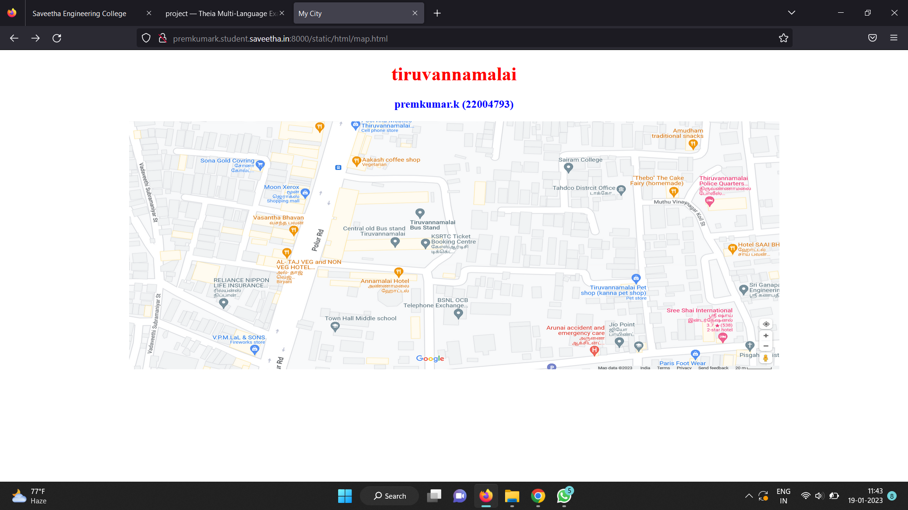
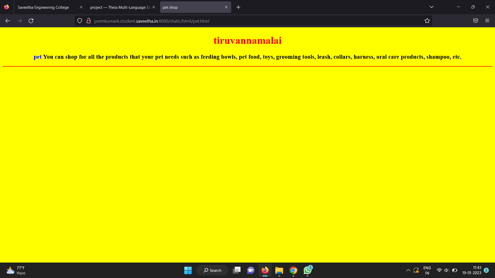
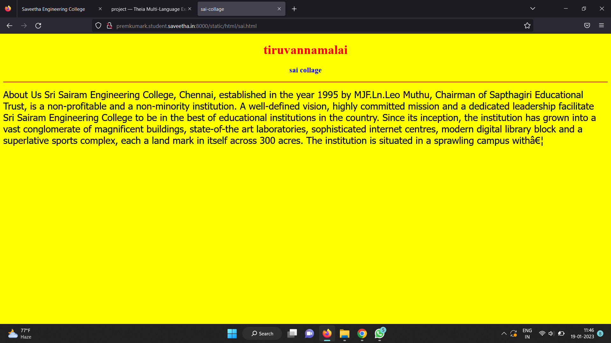
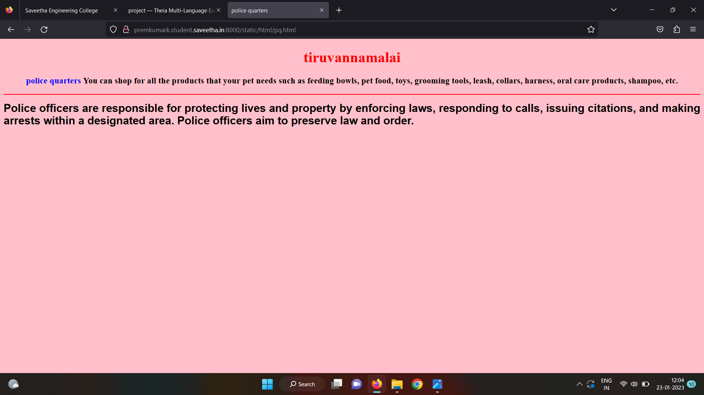
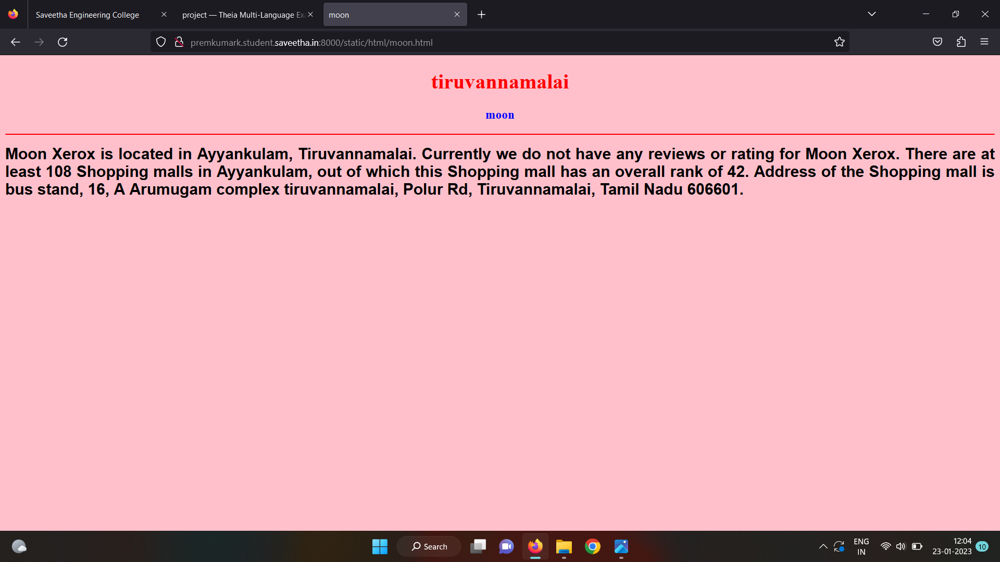
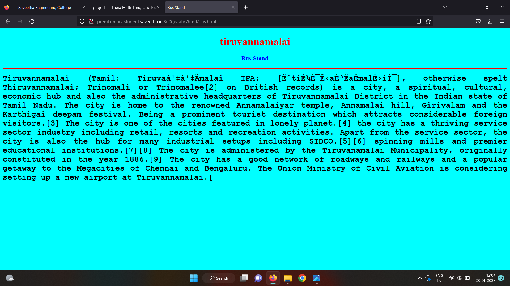

# Places Around Me
## AIM:
To develop a website to display details about the places around my house.

## Design Steps:

### Step 1:
Clone the github repository into Theia IDE. 

### Step 2:
Create a new djnago project.

### Step 3:
Write the needed HTML code.

### Step 4:
Run the django server and execute the HTML files.

## Code:
```
map.html
<!DOCTYPE html>
<html lang="en">
<head>
<title>My City</title>
</head>
<body>
<h1 align="center">
<font color="red"><b>tiruvannamalai</b></font>
</h1>
<h3 align="center">
<font color="blue"><b>premkumar.k (22004793)</b></font>
</h3>
<center>

<map name="MyCity">
<area shape="rectangle" coords="190,50,20,250" href="/static/html/moon.html" title="moon xerox">
<area shape="rectangle" coords="230,30,260,60" href="/static/html/sai.html" title="sairam collage">
<area shape="rectangle" coords="400,350,50,300" href="/static/html/pq.html" title="police headquazters">
<area shape="rectangle" coords="400,200,75,350" href="/static/html/bus.html" title="Bus Stand">
<area shape="rectangle" coords="490,150,870,320" href="/static/html/pet.html" title="pet shop">
</map>
</center>
</body>
</html>

bus.html
<!DOCTYPE html>
<html lang="en">
<head>
<title>Bus Stand</title>
</head>
<body bgcolor="cyan">
<h1 align="center">
<font color="red"><b>tiruvannamalai</b></font></h1>
<h3 align="center">
<font color="blue"><b> Bus Stand</b></font>
</h3>
<hr size="3" color="red">
<p align="justify">
<font face="Courier New" size="5">
<b>
Tiruvannamalai (Tamil: Tiruvaṇṇāmalai IPA: [ˈtiɾɯʋaɳːaːmalɛi̯], otherwise spelt Thiruvannamalai; Trinomali or Trinomalee[2] on British records) is a city, a spiritual, cultural, economic hub and also the administrative headquarters of Tiruvannamalai District in the Indian state of Tamil Nadu. The city is home to the renowned Annamalaiyar temple, Annamalai hill, Girivalam and the Karthigai deepam festival. Being a prominent tourist destination which attracts considerable foreign visitors.[3] The city is one of the cities featured in lonely planet.[4] the city has a thriving service sector industry including retail, resorts and recreation activities. Apart from the service sector, the city is also the hub for many industrial setups including SIDCO,[5][6] spinning mills and premier educational institutions.[7][8] The city is administered by the Tiruvanamalai Municipality, originally constituted in the year 1886.[9] The city has a good network of roadways and railways and a popular getaway to the Megacities of Chennai and Bengaluru. The Union Ministry of Civil Aviation is considering setting up a new airport at Tiruvannamalai.[</b>
</font>
</p>
</body>
</html>

moon.html
<!DOCTYPE html>
<html lang="en">
<head>
<title>moon</title>
</head>
<body bgcolor="pink">
<h1 align="center">
<font color="red"><b>tiruvannamalai</b></font>
</h1>
<h3 align="center">
<font color="blue"><b>moon</b></font>
</h3>
<hr size="3" color="red">
<p align="justify">
<font face="Arial" size="5">
<b>
Moon Xerox is located in Ayyankulam, Tiruvannamalai. Currently we do not have any reviews or rating for Moon Xerox. There are at least 108 Shopping malls in Ayyankulam, out of which this Shopping mall has an overall rank of 42. Address of the Shopping mall is bus stand, 16, A Arumugam complex tiruvannamalai, Polur Rd, Tiruvannamalai, Tamil Nadu 606601. 
</b>
</font>
</p>
</body>
</html>

sai.html

<!DOCTYPE html>
<html lang="en">
<head>
<title>sai-collage</title>
</head>
<body bgcolor="yellow">
<h1 align="center">
<font color="red"><b>tiruvannamalai</b></font>
</h1>
<h3 align="center">
<font color="blue"><b>sai collage</b></font>
</h3>
<hr size="3" color="red">
<p align="justify">
</font>
</p><font face="Tahoma" size="5">
About Us Sri Sairam Engineering College, Chennai, established in the year 1995 by MJF.Ln.Leo Muthu, Chairman of Sapthagiri Educational Trust, is a non-profitable and a non-minority institution. A well-defined vision, highly committed mission and a dedicated leadership facilitate Sri Sairam Engineering College to be in the best of educational institutions in the country. Since its inception, the institution has grown into a vast conglomerate of magnificent buildings, state-of-the art laboratories, sophisticated internet centres, modern digital library block and a superlative sports complex, each a land mark in itself across 300 acres. The institution is situated in a sprawling campus with…
</body>
</html>

pq.html
<!DOCTYPE html>
<html lang="en">
<head>
<title>police quarters</title>
</head>
<body bgcolor="pink">
<h1 align="center">
<font color="red"><b>tiruvannamalai</b></font>
</h1>
<h3 align="center">
<font color="blue"><b>police quarters</b></font>
You can shop for all the products that your pet needs such as feeding bowls, pet food, toys, grooming tools, leash, collars, harness, oral care products, shampoo, etc.
</h3>
<hr size="3" color="red">
<p align="justify">
<font face="Arial" size="5">
<b>

Police officers are responsible for protecting lives and property by enforcing laws, responding to calls, issuing citations, and making arrests within a designated area. Police officers aim to preserve law and order.
</b>
</font>
</p>
</body>
</html>

pet.html
<!DOCTYPE html>
<html lang="en">
<head>
<title>pet shop</title>
</head>
<body bgcolor="yellow">
<h1 align="center">
<font color="red"><b>tiruvannamalai</b></font>
</h1>
<h3 align="center">
<font color="blue"><b>pet</b></font>

<!DOCTYPE html>
<html lang="en">
<head>
<title>pet shop</title>
</html>
You can shop for all the products that your pet needs such as feeding bowls, pet food, toys, grooming tools, leash, collars, harness, oral care products, shampoo, etc.
</h3>
<hr size="3" color="red">
<p align="justify">
<font face="Tahoma" size="5">
</font>
</p>
</body>
</html>
```

## Output:












## HTML Validator:


## Result:
The program for implementing image map is executed successfully